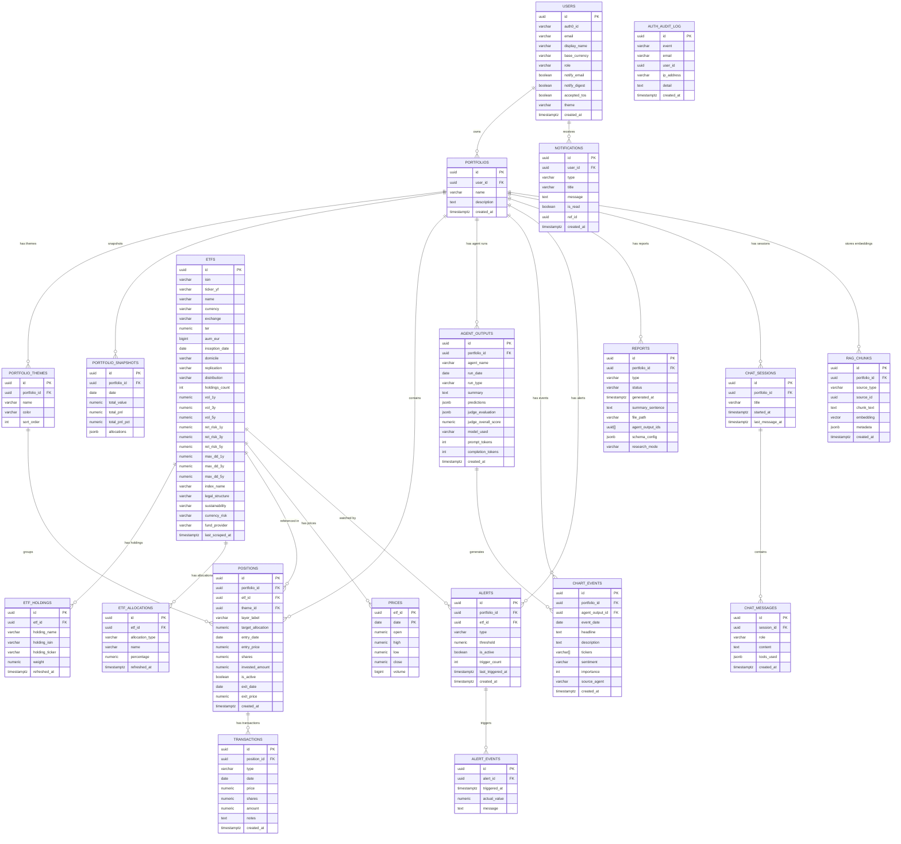
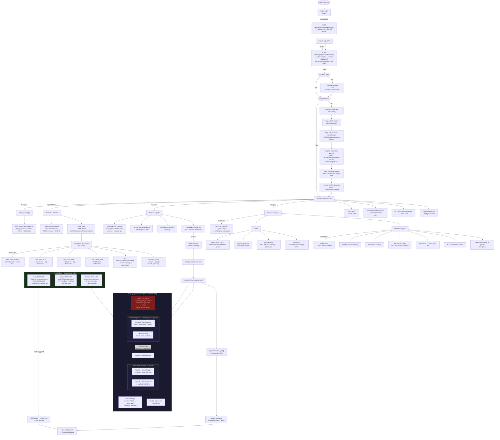

# ETF IQ — AI-Powered ETF Portfolio Manager

ETF IQ is a full-stack application that combines portfolio tracking, AI-driven research agents, interactive charting, and a conversational AI assistant to help investors monitor and analyse their ETF portfolios.

> **Disclaimer:** This application is for informational purposes only. Nothing in ETF IQ constitutes financial advice.

---

## Table of Contents

- [Features Overview](#features-overview)
- [Tech Stack](#tech-stack)
- [Architecture](#architecture)
- [Pages and User Flows](#pages-and-user-flows)
- [AI Agent Pipeline](#ai-agent-pipeline)
- [Data Connectors](#data-connectors)
- [API Reference](#api-reference)
- [Database Schema](#database-schema)
- [Scheduled Jobs](#scheduled-jobs)
- [Getting Started](#getting-started)
- [Environment Variables](#environment-variables)
- [Project Structure](#project-structure)

---

## Features Overview

### Portfolio Management

- Create portfolios with custom names and descriptions
- Add ETF positions with shares, entry price, entry date, and target allocation
- Sell positions (partial or full close) with sell price, date, notes, and live P&L preview
- Adding shares to an existing ETF averages into the position; each buy/sell logged as a transaction
- Closed positions hidden from dashboard; full trade journal in History > Trades tab
- Organise positions into investment themes (AI Stack, Gold, Defence, Other)
- Track real-time P&L per position and total portfolio value
- View allocation vs. target allocation per ETF

### Interactive Charts (6 modes)

- **Line / Bar** — normalised % growth time series, multi-ETF comparison
- **Drawdown** — rolling maximum drawdown per ETF
- **Risk / Return** — scatter plot of annualised return vs. volatility
- **Correlation heatmap** — pairwise correlation matrix across your ETFs
- **Monthly returns heatmap** — calendar-style monthly return breakdown
- **News event overlay** — vertical markers on time-series charts linked to AI-extracted news events

### ETF Analytics

- Live quote per ETF: last close, day change, 52-week high/low
- Deep ETF detail: AUM, TER, index name, replication, domicile, legal structure, currency risk, sustainability, inception date
- Risk metrics: Volatility, Return-per-risk, Max Drawdown across 1Y / 3Y / 5Y windows
- Top-10 holdings table with ISIN and weight
- Sector and country allocation bar charts
- Holding overlap warnings across portfolio ETFs

### AI Research Agents (dynamic + 4 fixed, weekly cadence)

- **Dynamic Theme Agents** — built at runtime from portfolio themes (e.g., "AI Stack Analyst", "Gold Analyst", "Defence Analyst"); each covers the ETFs assigned to its theme
- **Macro Analyst** — macroeconomic and broad market research covering the entire portfolio
- **Risk Assessor** — cross-agent risk synthesis from all research outputs
- **Event Mapper** — maps research findings to chart events with dates, tickers, and sentiment
- **Recommender** — actionable buy/hold/sell recommendations from all agent context
- **Judge** — evaluates past predictions against what actually happened (web search grounded), scoring 0–10 across correctness, confidence calibration, and reasoning validity

Agents use a **memory-reflection loop**: before each run, agents load their previous output and Judge score, then acknowledge past mistakes in their prompt before producing new research. Predictions are structured JSON with confidence (1–10) and timeframe.

### "Charles" — AI Portfolio Assistant (Chat)

- Conversational AI assistant backed by Gemini with real-time SSE streaming
- Perplexity-style new thread landing page with centered input and placeholder buttons
- Multi-session conversation history persisted to database
- Five built-in tools:
  - **Web search** — live Google Search grounding via Gemini
  - **Portfolio knowledge search** — semantic search over past agent reports (RAG with pgvector)
  - **Create alert** — creates price alerts directly from the chat
  - **Close trade** — sell shares from a position via natural language (e.g. "sell 200 shares of ARMG at 25.50")
  - **Open trade** — buy shares or add to existing position via natural language
- Source citations rendered as clickable chips
- Session rename and delete

### Report Generation

- **Weekly Health Report** — PDF covering all agent outputs, risk summary, and recommendations
- **Monthly Deep Research Report** — extended thinking mode (Gemini thinking budget: 32,768 tokens)
- Dynamic sections: Exec Summary + portfolio theme sections + Macro, Risk, Recommendations
- PDF download, status polling, and archive table
- **Agent Memory Explorer** — grid showing Judge scores per agent per week (last 8 runs), colour-coded green/amber/red

### Price Alerts

- Alert types: `price_above`, `price_below`, `pct_change`, `volatility`
- Per-ETF thresholds with active/inactive toggle
- Full trigger history with timestamp, actual value, and message
- Alert evaluation runs automatically after each daily price sync

### Notifications

- In-app notification feed (bell icon in top nav)
- Notification types: `report_ready`, `alert_triggered`, `alert_configured`
- Mark individual or all notifications as read

### Onboarding Wizard

- 5-step guided flow for first-time users
- ETF search by name or ISIN
- **LLM-powered theme classification** — Gemini analyses selected ETFs and assigns investment themes automatically
- **Dual correlation analysis** — price correlation + holdings overlap detection with flagging of highly correlated pairs
- **LLM-powered advisor** — ranks correlated pairs and suggests replacement ETFs from the JustETF universe
- Position details (shares, entry price, entry date, target allocation)
- Confirmation summary before portfolio creation
- Re-onboarding cleans up existing portfolios for a fresh start

### Settings

- Display name, base currency (EUR, USD, GBP, CHF, JPY, CAD)
- Light / Dark / System theme (persisted to DB)
- Email notifications and weekly digest toggle

### Authentication & Security

- **Auth0 passwordless email OTP** — no passwords, 6-digit code sent to email
- **Internal HS256 JWT** session cookies after OTP verification (HttpOnly `access_token` + JS-readable `access_token_js`)
- **Token revocation** — Redis-backed blocklist; tokens revoked on logout and refresh (fails open if Redis is down)
- **OTP rate limiting** — Redis sliding-window: max 3 `/start` requests per email per hour, max 5 `/verify` attempts per email per 10 minutes
- **Security audit logging** — structured JSON events (`LOGIN_SUCCESS`, `LOGIN_FAILURE`, `LOGOUT`, `TOKEN_REFRESH`, `OTP_RATE_LIMITED`, etc.) to stdout; optionally persisted to `auth_audit_log` DB table
- **Algorithm confusion guard** — rejects any Auth0 token not signed with RS256
- **JWKS caching** — Auth0 public keys cached 1 hour with async lock and emergency key rotation support
- **Auth0 Management API** — async client for admin user CRUD (create, disable, enable, lookup)
- **Global rate limiting** — slowapi (60 req/min per user), Redis-backed when available
- Role hierarchy: `user → admin → super_admin`
- Terms of Service acceptance gate (blocking modal on first login)

---

## Tech Stack

| Layer          | Technologies                                                                                                                                                |
| -------------- | ----------------------------------------------------------------------------------------------------------------------------------------------------------- |
| **Frontend**   | Node 20, TypeScript 5.9, Vite 7, React 19, Tailwind CSS 4, Radix UI / shadcn, TanStack React Query v5, lightweight-charts v5, Recharts, Three.js (3D globe) |
| **Backend**    | Python 3.11, FastAPI, Uvicorn, SQLAlchemy 2.0 async, asyncpg, Alembic                                                                                       |
| **AI / LLM**   | Google Gemini (`google-genai`), LangChain ReAct agent (chat), pgvector RAG (768-dim embeddings)                                                             |
| **Auth**       | Auth0 passwordless email OTP + internal HS256 JWT                                                                                                           |
| **Database**   | PostgreSQL 15 with pgvector extension                                                                                                                       |
| **Data**       | Yahoo Finance (`yfinance`), JustETF (`justetf-scraping` + custom HTML scraper)                                                                              |
| **Scheduler**  | APScheduler (`AsyncIOScheduler`)                                                                                                                            |
| **Email**      | Resend API (transactional — weekly digests, alert notifications)                                                                                            |
| **Cache**      | Redis 7 (token revocation blocklist, OTP rate limiting, distributed rate limits)                                                                            |
| **Containers** | Docker + Docker Compose (4 services: postgres, redis, unified-api, frontend/Nginx)                                                                          |

---

## Architecture

```
┌─────────────────────────────────────────────────┐
│  Frontend (React / Vite / Nginx, port 3000)      │
│  - SPA served via Nginx                          │
│  - All API calls proxied to /api → backend       │
└───────────────────┬─────────────────────────────┘
                    │ HTTP / SSE
┌───────────────────▼─────────────────────────────┐
│  Backend — unified-api (FastAPI, port 8000)      │
│  - 14 API routers                                │
│  - Auth0 OTP + internal JWT + token revocation   │
│  - APScheduler (3 cron jobs)                     │
│  - 8 Gemini-powered AI agents                    │
│  - LangChain ReAct chat agent (5 tools)           │
│  - PDF report generation (ReportLab)             │
│  - data-connectors package                       │
└───────────────────┬─────────────────────────────┘
                    │ asyncpg
┌───────────────────▼─────────────────────────────┐
│  PostgreSQL 15 + pgvector (port 5432)            │
│  - 19 tables                                     │
│  - IVFFlat cosine index on rag_chunks            │
└─────────────────────────────────────────────────┘
                    │ redis-py async
┌───────────────────▼─────────────────────────────┐
│  Redis 7 (port 6379)                             │
│  - Token revocation blocklist (TTL-based)        │
│  - OTP sliding-window rate limiters              │
│  - Global rate limit store (slowapi)             │
└─────────────────────────────────────────────────┘
```

**Data connectors** run as part of the backend process (same container), triggered by APScheduler or admin API endpoints.

---

## Pages and User Flows

| Route                 | Page       | Description                                                                              |
| --------------------- | ---------- | ---------------------------------------------------------------------------------------- |
| `/login`              | Login      | Passwordless email OTP — 2-step flow                                                     |
| `/terms`              | Terms      | Static Terms of Service                                                                  |
| `/privacy`            | Privacy    | Static Privacy Policy                                                                    |
| `/:userId/onboarding` | Onboarding | 5-step wizard to create first portfolio                                                  |
| `/:userId/dashboard`  | Dashboard  | Portfolio health, value chart, themes, allocation, alerts                                |
| `/:userId/analysis`   | Analysis   | Chart workspace (6 modes) + Quote / Positions / ETF Detail / Agent Reports / Alerts tabs |
| `/:userId/reports`    | Reports    | Generate reports, view archive, Agent Memory Explorer                                    |
| `/:userId/charles`    | Charles    | Perplexity-style new thread or active conversation with AI assistant                     |
| `/:userId/history`    | History    | Threads, Trades (journal + by ETF), Documents tabs with search and batch delete          |
| `/:userId/account`    | Account    | Profile, appearance, currency, notifications, legal links                                |

**Route guards:** `ProtectedRoute` (auth), `UserRouteGuard` (own userId only), `OnboardingGuard` (forces wizard if no portfolios), `TosGuard` (blocks all UI until ToS accepted).

---

## AI Agent Pipeline

### WeeklyOrchestrator

The `WeeklyOrchestrator` (`unified-api/app/agents/orchestrator.py`) runs every Monday at 08:00 UTC (or on-demand via admin API / report generation). It executes a **4-phase pipeline** per portfolio:

```
Phase 1: Judge Agent        — scores last week's predictions (web search grounded)
Phase 2: Research × N       — dynamic theme agents + Macro (parallel, asyncio.gather)
Phase 3: Risk Assessor      — synthesises research into risk assessment
Phase 4: Event Mapper       — extracts chart events from research  ┐ parallel
         Recommender        — generates actionable recommendations ┘
Post:    Email digest        — sends weekly digest to subscribed users
```

**Dynamic theme agents**: Research agents are built at runtime from portfolio themes (not hardcoded). Each `PortfolioTheme` maps to a `DynamicThemeAgent` that covers the ETFs assigned to that theme. The `MacroAgent` covers the entire portfolio.

### BaseAgent Reflection Loop

Each research agent inherits from `BaseAgent` (`unified-api/app/agents/base_agent.py`) and follows this cycle:

1. **Load context** — portfolio positions, prices, allocations via `context_builder`
2. **Load past output** — most recent previous `AgentOutput` for this agent
3. **Build reflection block** — if a Judge evaluation exists, inject the `REFLECTION_TEMPLATE` which forces the agent to acknowledge past mistakes before producing new analysis
4. **Call Gemini** — with Google Search grounding; uses `DEEP_RESEARCH_CONFIG` (thinking_budget=32768) or `STANDARD_CONFIG` based on `run_type`
5. **Parse predictions** — extract structured JSON predictions (2–5 per agent, confidence 1–10, timeframe)
6. **Store output** — upsert to `agent_outputs` table (idempotent via unique constraint on `portfolio_id + agent_name + run_date + run_type`)
7. **Embed to RAG** — fire-and-forget embedding into `rag_chunks` (pgvector 768-dim) for chat knowledge search

### ReportOrchestrator

The `ReportOrchestrator` (`unified-api/app/agents/report_orchestrator.py`) handles on-demand PDF report generation, triggered by `POST /reports`:

```
1. Update report status → "running"
2. Run WeeklyOrchestrator.run()     ← full agent pipeline (standard or deep_research)
3. Load all AgentOutputs for the run date
4. Build section→agent mapping      ← "Exec Summary" + theme sections + "Macro", "Risk", "Recommendations"
5. ReportWriter.build_pdf()          ← ReportLab A4 PDF with navy/blue theme, markdown rendering
6. Update report status → "complete", store file_path, extract summary_sentence
7. Create "report_ready" Notification
```

**Report types:**

- **Weekly Health Report** (`run_type="standard"`) — standard Gemini config
- **Monthly Deep Research Report** (`run_type="deep_research"`) — Gemini with `thinking_budget=32768` and `max_output_tokens=16384`

**Section ordering** is dynamic: `["Exec Summary"] + [theme names from portfolio] + ["Macro", "Risk", "Recommendations"]`. Each section maps to an agent name (e.g., theme "AI Stack" → `ai_stack_analyst`, "Macro" → `macro_analyst`).

**PDF generation** (`unified-api/app/agents/report_writer.py`): Uses ReportLab Platypus with A4 pages, inline markdown-to-paragraph conversion (bold, italic), footer with disclaimer + page numbers, and navy colour scheme. Output stored in `data/reports/` with UUID-based filenames.

**Error handling**: If any step fails, the report status is set to `"failed"` and the error is logged. The agent pipeline uses `asyncio.gather(return_exceptions=True)` so individual agent failures don't crash the entire run.

---

## Data Connectors

All connectors implement the `BaseConnector` ABC: `fetch()` → `normalize()` → `ingest()`.

| Connector                   | Registry Name       | Source             | Schedule         | Data                                         |
| --------------------------- | ------------------- | ------------------ | ---------------- | -------------------------------------------- |
| `YFinanceConnector`         | `yfinance`          | Yahoo Finance      | Daily 06:00 UTC  | OHLCV price data for all portfolio ETFs      |
| `JustETFConnector`          | `justetf`           | JustETF (scraper)  | Sunday 22:00 UTC | ETF metadata, holdings, allocations, overlap |
| `JustETFDiscoveryConnector` | `justetf_discovery` | JustETF search API | On-demand        | ETF search for onboarding / discovery        |

---

## API Reference

### Authentication (`/auth`)

| Method | Endpoint                          | Description                                                                  |
| ------ | --------------------------------- | ---------------------------------------------------------------------------- |
| POST   | `/auth/login/passwordless/start`  | Send OTP email (rate-limited: 3/hour per email)                              |
| POST   | `/auth/login/passwordless/verify` | Verify OTP, issue JWT, set session cookies (rate-limited: 5/10min per email) |
| POST   | `/auth/refresh`                   | Slide token expiry — revokes old token, issues new one                       |
| GET    | `/auth/get-auth-role`             | Get current user id/email/role                                               |
| POST   | `/auth/logout`                    | Revoke token, clear session cookies                                          |

### Portfolios (`/portfolios`)

| Method | Endpoint                                  | Description                                                                |
| ------ | ----------------------------------------- | -------------------------------------------------------------------------- |
| GET    | `/portfolios`                             | List user's portfolios                                                     |
| POST   | `/portfolios`                             | Create portfolio                                                           |
| GET    | `/portfolios/{id}`                        | Portfolio detail with P&L (active positions only)                          |
| POST   | `/portfolios/{id}/positions`              | Add position (logs buy transaction; adds to existing position if same ETF) |
| POST   | `/portfolios/{id}/positions/{posId}/sell` | Sell shares (partial or full close with P&L)                               |
| GET    | `/portfolios/{id}/transactions`           | Full trade journal (all buys and sells with P&L)                           |
| GET    | `/portfolios/{id}/snapshot`               | Latest daily snapshot                                                      |
| GET    | `/portfolios/{id}/overlap`                | Holding overlap matrix                                                     |

### ETFs (`/etfs`)

| Method | Endpoint             | Description                   |
| ------ | -------------------- | ----------------------------- |
| GET    | `/etfs`              | List all ETFs                 |
| GET    | `/etfs/search?q=`    | Search by name/ISIN/ticker    |
| GET    | `/etfs/discover?q=`  | Live search JustETF universe  |
| GET    | `/etfs/{isin}/quote` | Live quote with 52-week range |
| GET    | `/etfs/{isin}`       | Full ETF detail with holdings |

### Prices (`/prices`)

| Method | Endpoint                    | Description                 |
| ------ | --------------------------- | --------------------------- |
| GET    | `/prices?etf_id=&from=&to=` | OHLCV price series          |
| POST   | `/prices/sync`              | Trigger yfinance price sync |

### Analytics (`/analytics`)

| Method | Endpoint                                | Description                                                             |
| ------ | --------------------------------------- | ----------------------------------------------------------------------- |
| GET    | `/analytics/risk-metrics?portfolio_id=` | Annualised return, volatility, Sharpe, max drawdown, correlation matrix |

### Chat (`/chat`)

| Method | Endpoint                       | Description                               |
| ------ | ------------------------------ | ----------------------------------------- |
| POST   | `/chat`                        | Send message — returns SSE stream         |
| GET    | `/chat/sessions?portfolio_id=` | List sessions (with last message snippet) |
| PATCH  | `/chat/sessions/{id}`          | Rename session                            |
| DELETE | `/chat/sessions/{id}`          | Delete session                            |
| POST   | `/chat/sessions/batch-delete`  | Batch delete sessions                     |
| GET    | `/chat/sessions/{id}/messages` | Message history                           |

### Reports (`/reports`)

| Method | Endpoint                 | Description                                   |
| ------ | ------------------------ | --------------------------------------------- |
| POST   | `/reports`               | Trigger report generation (async)             |
| GET    | `/reports/{id}/status`   | Poll status (pending/running/complete/failed) |
| GET    | `/reports/{id}/download` | Download PDF                                  |
| DELETE | `/reports/{id}`          | Delete report and file                        |
| GET    | `/reports?portfolio_id=` | List reports                                  |

### Alerts (`/alerts`)

| Method | Endpoint                | Description                       |
| ------ | ----------------------- | --------------------------------- |
| GET    | `/alerts?portfolio_id=` | List alerts with trigger history  |
| POST   | `/alerts`               | Create alert                      |
| PUT    | `/alerts/{id}`          | Update threshold or active status |
| DELETE | `/alerts/{id}`          | Deactivate alert                  |

### Agent Outputs (`/agent-outputs`)

| Method | Endpoint                                     | Description                       |
| ------ | -------------------------------------------- | --------------------------------- |
| GET    | `/agent-outputs/scores?portfolio_id=&weeks=` | Judge score time-series per agent |
| GET    | `/agent-outputs?portfolio_id=&agent=`        | Full agent output records         |

### Events (`/events`)

| Method | Endpoint                                   | Description                       |
| ------ | ------------------------------------------ | --------------------------------- |
| GET    | `/events?portfolio_id=&tickers=&from=&to=` | Chart events (news/macro overlay) |

### Notifications (`/notifications`)

| Method | Endpoint                   | Description           |
| ------ | -------------------------- | --------------------- |
| GET    | `/notifications`           | Last 50 notifications |
| PATCH  | `/notifications/{id}/read` | Mark as read          |
| POST   | `/notifications/read-all`  | Mark all as read      |

### Users (`/users`)

| Method | Endpoint                | Description                                              |
| ------ | ----------------------- | -------------------------------------------------------- |
| GET    | `/users/me`             | Current user profile                                     |
| PUT    | `/users/me/preferences` | Update display name, currency, theme, notifications, ToS |

### Onboarding (`/onboarding`)

| Method | Endpoint                      | Description                                                           |
| ------ | ----------------------------- | --------------------------------------------------------------------- |
| GET    | `/onboarding/status`          | Check if current user has completed onboarding                        |
| POST   | `/onboarding/classify-themes` | LLM-powered ETF theme classification                                  |
| POST   | `/onboarding/correlations`    | Dual correlation analysis (price + holdings overlap)                  |
| POST   | `/onboarding/advisor`         | LLM-powered rankings and replacement suggestions for correlated pairs |
| POST   | `/onboarding/complete`        | Create portfolio with themes and positions, mark user as onboarded    |

### Meta (`/meta`)

| Method | Endpoint        | Description                                                              |
| ------ | --------------- | ------------------------------------------------------------------------ |
| GET    | `/meta/og?url=` | Fetch Open Graph metadata (title, description, image, favicon) for a URL |

### Admin (`/admin`) — requires `admin` role

| Method | Endpoint                       | Description                 |
| ------ | ------------------------------ | --------------------------- |
| POST   | `/admin/connectors/{name}/run` | Run a named data connector  |
| POST   | `/admin/agents/run`            | Run the full agent pipeline |
| GET    | `/admin/costs?month=&user_id=` | Gemini token cost breakdown |

---

## Database Schema

20 tables across PostgreSQL 15 + pgvector:

| Table                 | Purpose                                                              |
| --------------------- | -------------------------------------------------------------------- |
| `users`               | User accounts, roles, preferences                                    |
| `portfolios`          | User-owned portfolios                                                |
| `portfolio_themes`    | Investment themes grouping positions                                 |
| `portfolio_snapshots` | Daily portfolio value snapshots                                      |
| `etfs`                | ETF registry with metadata and risk metrics                          |
| `etf_holdings`        | Top-10 holdings per ETF                                              |
| `etf_allocations`     | Sector and country allocations per ETF                               |
| `positions`           | Individual ETF holdings within a portfolio                           |
| `transactions`        | Buy/sell transaction history per position                            |
| `prices`              | OHLCV daily price time-series                                        |
| `agent_outputs`       | AI agent research outputs with Judge scores                          |
| `chart_events`        | News/macro events mapped to chart dates                              |
| `alerts`              | Price and volatility alerts                                          |
| `alert_events`        | Alert trigger history                                                |
| `chat_sessions`       | Chat conversation sessions                                           |
| `chat_messages`       | Individual chat messages                                             |
| `reports`             | Generated PDF report metadata                                        |
| `rag_chunks`          | Vector embeddings (768-dim) for semantic search                      |
| `notifications`       | In-app notification feed                                             |
| `auth_audit_log`      | Security audit events (login, logout, rate limits, token revocation) |

---

## Scheduled Jobs

| Job                 | Schedule            | Action                                                                    |
| ------------------- | ------------------- | ------------------------------------------------------------------------- |
| Daily price sync    | Every day 06:00 UTC | Fetch 5 days of prices via yfinance → evaluate all active alerts          |
| Weekly ETF metadata | Sunday 22:00 UTC    | Full JustETF scrape → update ETF metadata, holdings, allocations, overlap |
| Weekly AI agents    | Monday 08:00 UTC    | Run all 8 agents for every portfolio → send weekly digest emails          |

---

## Getting Started

### Prerequisites

- Docker and Docker Compose
- Auth0 account (passwordless email OTP connection enabled)
- Google AI API key (Gemini)
- Redis 7 (included in Docker Compose — required for token revocation and OTP rate limiting)

### 1. Clone and configure

```bash
git clone <repo-url>
cd ETF_IQ
cp .env.example .env
# Edit .env with your credentials (see Environment Variables section)
```

### 2. Start the stack

```bash
docker compose up --build
```

This will:

1. Start PostgreSQL with pgvector and Redis 7
2. Run Alembic migrations (`alembic upgrade head`)
3. Seed 7 default ETFs
4. Backfill RAG embeddings for existing data
5. Start the FastAPI backend on port 8000 (with Redis-backed token blocklist and OTP rate limiting)
6. Build and serve the React frontend via Nginx on port 3000

### 3. Access the app

- **Frontend**: http://localhost:3000
- **API docs**: http://localhost:8000/docs

### 4. First login

The app uses Auth0 passwordless email OTP. Users must be pre-created in the `users` table with `is_active=true` before they can log in — Auth0 acts as the OTP delivery provider, but the backend validates the email against the local user allowlist. On first successful OTP, the user's `auth0_id` is linked automatically.

---

## Environment Variables

| Variable                      | Required | Description                                                                                                      |
| ----------------------------- | -------- | ---------------------------------------------------------------------------------------------------------------- |
| `POSTGRES_USER`               | Yes      | PostgreSQL username                                                                                              |
| `POSTGRES_PASSWORD`           | Yes      | PostgreSQL password                                                                                              |
| `POSTGRES_DB`                 | Yes      | PostgreSQL database name                                                                                         |
| `DATABASE_URL`                | Yes      | Full asyncpg connection string                                                                                   |
| `GOOGLE_API_KEY`              | Yes      | Gemini API key                                                                                                   |
| `GEMINI_MODEL`                | No       | Model name (default: `models/gemini-3.1-pro-preview`)                                                            |
| `AUTH0_DOMAIN`                | Yes      | Auth0 tenant domain (e.g. `your-tenant.auth0.com`)                                                               |
| `AUTH0_CLIENT_ID`             | Yes      | Auth0 application client ID                                                                                      |
| `AUTH0_CLIENT_SECRET`         | Yes      | Auth0 application client secret                                                                                  |
| `AUTH0_AUDIENCE`              | Yes      | Auth0 API identifier                                                                                             |
| `AUTH0_MGMT_CLIENT_ID`        | No       | Auth0 Management API M2M client ID (for admin user CRUD)                                                         |
| `AUTH0_MGMT_CLIENT_SECRET`    | No       | Auth0 Management API M2M client secret                                                                           |
| `JWT_SECRET_KEY`              | Yes      | Secret for internal HS256 JWT signing — generate with `python -c "import secrets; print(secrets.token_hex(32))"` |
| `ACCESS_TOKEN_EXPIRE_MINUTES` | No       | Session duration in minutes (default: 600)                                                                       |
| `REDIS_URL`                   | No       | Redis connection URL (default: `redis://localhost:6379/0`; auto-set in Docker Compose)                           |
| `USE_REDIS`                   | No       | Enable Redis for token blocklist and OTP rate limiting (default: `false`; auto-set to `true` in Docker Compose)  |
| `PERSIST_AUDIT_LOG`           | No       | Persist auth audit events to `auth_audit_log` DB table (default: `false`; always logged to stdout)               |
| `RESEND_API_KEY`              | No       | Resend API key for transactional email                                                                           |
| `EMAIL_FROM`                  | No       | Sender address for digest/alert emails                                                                           |
| `GATEWAY_PORT`                | No       | Backend port mapping (default: 8000)                                                                             |
| `FRONTEND_PORT`               | No       | Frontend port mapping (default: 3000)                                                                            |

Optional data source keys: `FRED_API_KEY`, `METALS_API_KEY`, `NEWSDATA_API_KEY`, `FIRECRAWL_API_KEY`

---

## Database Diagram

Full entity-relationship diagram of all 20 tables.



---

## API Structure

All 14 routers and their endpoints, grouped by domain.

```mermaid
graph TD
    Client(["Browser / Frontend"]) -->|HTTP + SSE| GW["FastAPI Gateway\n:8000"]

    GW --> R_AUTH["/auth"]
    GW --> R_PORT["/portfolios"]
    GW --> R_ETF["/etfs"]
    GW --> R_PRICE["/prices"]
    GW --> R_ANA["/analytics"]
    GW --> R_CHAT["/chat"]
    GW --> R_REP["/reports"]
    GW --> R_ALERT["/alerts"]
    GW --> R_AO["/agent-outputs"]
    GW --> R_EV["/events"]
    GW --> R_NOTIF["/notifications"]
    GW --> R_USER["/users"]
    GW --> R_ONBOARD["/onboarding"]
    GW --> R_META["/meta"]
    GW --> R_ADMIN["/admin 🔒"]

    R_AUTH --> A1["POST /login/passwordless/start"]
    R_AUTH --> A2["POST /login/passwordless/verify"]
    R_AUTH --> A3["POST /refresh"]
    R_AUTH --> A4["GET  /get-auth-role"]
    R_AUTH --> A5["POST /logout"]

    R_PORT --> P1["GET  /portfolios"]
    R_PORT --> P2["POST /portfolios"]
    R_PORT --> P3["GET  /portfolios/:id"]
    R_PORT --> P4["POST /portfolios/:id/positions"]
    R_PORT --> P5["POST /portfolios/:id/positions/:posId/sell"]
    R_PORT --> P6["GET  /portfolios/:id/transactions"]
    R_PORT --> P7["GET  /portfolios/:id/snapshot"]
    R_PORT --> P8["GET  /portfolios/:id/overlap"]

    R_ETF --> E1["GET  /etfs"]
    R_ETF --> E2["GET  /etfs/search?q="]
    R_ETF --> E3["GET  /etfs/discover?q="]
    R_ETF --> E4["GET  /etfs/:isin/quote"]
    R_ETF --> E5["GET  /etfs/:isin"]

    R_PRICE --> PR1["GET  /prices?etf_id=&from=&to="]
    R_PRICE --> PR2["POST /prices/sync"]

    R_ANA --> AN1["GET  /analytics/risk-metrics?portfolio_id="]

    R_CHAT --> C1["POST /chat  ← SSE stream"]
    R_CHAT --> C2["GET  /chat/sessions"]
    R_CHAT --> C3["PATCH /chat/sessions/:id"]
    R_CHAT --> C4["DELETE /chat/sessions/:id"]
    R_CHAT --> C5["POST /chat/sessions/batch-delete"]
    R_CHAT --> C6["GET  /chat/sessions/:id/messages"]

    R_REP --> RE1["POST /reports"]
    R_REP --> RE2["GET  /reports/:id/status"]
    R_REP --> RE3["GET  /reports/:id/download"]
    R_REP --> RE4["DELETE /reports/:id"]
    R_REP --> RE5["GET  /reports?portfolio_id="]

    R_ALERT --> AL1["GET  /alerts?portfolio_id="]
    R_ALERT --> AL2["POST /alerts"]
    R_ALERT --> AL3["PUT  /alerts/:id"]
    R_ALERT --> AL4["DELETE /alerts/:id"]

    R_AO --> AO1["GET  /agent-outputs/scores"]
    R_AO --> AO2["GET  /agent-outputs"]

    R_EV --> EV1["GET  /events?portfolio_id=&tickers="]

    R_NOTIF --> N1["GET  /notifications"]
    R_NOTIF --> N2["PATCH /notifications/:id/read"]
    R_NOTIF --> N3["POST /notifications/read-all"]

    R_USER --> U1["GET  /users/me"]
    R_USER --> U2["PUT  /users/me/preferences"]

    R_ONBOARD --> OB1_API["GET  /onboarding/status"]
    R_ONBOARD --> OB2_API["POST /onboarding/classify-themes"]
    R_ONBOARD --> OB3_API["POST /onboarding/correlations"]
    R_ONBOARD --> OB4_API["POST /onboarding/advisor"]
    R_ONBOARD --> OB5_API["POST /onboarding/complete"]

    R_META --> M1["GET  /meta/og?url="]

    R_ADMIN --> AD1["POST /admin/connectors/:name/run"]
    R_ADMIN --> AD2["POST /admin/agents/run"]
    R_ADMIN --> AD3["GET  /admin/costs"]

    style R_ADMIN fill:#7f1d1d,color:#fecaca
    style Client fill:#1e3a5f,color:#bfdbfe
    style GW fill:#1e3a5f,color:#bfdbfe
    style C1 fill:#14532d,color:#bbf7d0
```



---

## Application Flow

End-to-end flow of the entire application — from user login through all major features.



---

## Project Structure

```
ETF_IQ/
├── docker-compose.yaml          # Service orchestration (postgres, redis, api, frontend)
├── .env.example                 # Environment variable template
│
├── frontend/                    # React SPA
│   ├── src/
│   │   ├── App.tsx              # Routes and guards
│   │   ├── pages/               # Login, Dashboard, Analysis, Reports, Charles, History, Account, Onboarding
│   │   ├── components/          # UI components (analysis, charts, dashboard, chat, reports, trade)
│   │   ├── hooks/               # React Query hooks (portfolios, prices, chat, alerts, transactions, etc.)
│   │   ├── contexts/            # UserContext (auth state), ThemeContext
│   │   └── lib/                 # API client, utilities
│   └── Dockerfile
│
├── unified-api/                 # FastAPI backend
│   ├── app/
│   │   ├── main.py              # App bootstrap, 14 routers, rate limiting
│   │   ├── auth/                # Auth0 OTP, JWT, token blocklist, OTP rate limiter, audit log, management API
│   │   ├── routers/             # portfolios, etfs, prices, analytics, chat, reports, alerts, onboarding, meta, …
│   │   ├── agents/
│   │   │   ├── base_agent.py    # BaseAgent ABC with reflection loop
│   │   │   ├── orchestrator.py  # WeeklyOrchestrator (4-phase pipeline)
│   │   │   ├── report_orchestrator.py  # ReportOrchestrator (on-demand PDF)
│   │   │   ├── report_writer.py # PDF generation (ReportLab)
│   │   │   ├── chat_agent.py    # LangChain ReAct chatbot (5 tools: web, RAG, alerts, trade open/close)
│   │   │   ├── judge.py         # JudgeAgent (evaluates predictions)
│   │   │   ├── risk_assessor.py # Risk synthesis agent
│   │   │   ├── recommender.py   # Action recommendations agent
│   │   │   ├── event_mapper.py  # Chart event extraction agent
│   │   │   ├── context_builder.py # Portfolio context for prompts
│   │   │   ├── llm_client.py    # Gemini API wrapper
│   │   │   ├── research/        # DynamicThemeAgent, MacroAgent, AI Stack, Gold, Defence
│   │   │   ├── onboarding/      # Theme classifier, correlation analysis, advisor
│   │   │   ├── prompts/v1/      # Versioned prompt templates
│   │   │   └── tools/           # rag_store.py (pgvector), report_history.py
│   │   ├── models/              # SQLAlchemy ORM models (20 tables)
│   │   ├── schemas/             # Pydantic request/response models
│   │   ├── services/            # email.py (Resend), cost_tracker.py (Gemini token costs)
│   │   └── config.py            # Pydantic settings
│   ├── alembic/                 # Database migrations
│   ├── entrypoint.sh            # Startup: migrate → seed → backfill → serve
│   └── Dockerfile
│
├── data-connectors/             # Standalone Python package
│   └── data_connectors/
│       ├── base.py              # BaseConnector ABC
│       ├── registry.py          # Connector registry
│       ├── scheduler.py         # APScheduler cron jobs
│       ├── yfinance_conn/       # Yahoo Finance price connector
│       ├── justetf_conn/        # JustETF metadata/holdings connector
│       └── justetf_discovery/   # JustETF ETF search connector
│
└── db/                          # DB seed utilities
```
